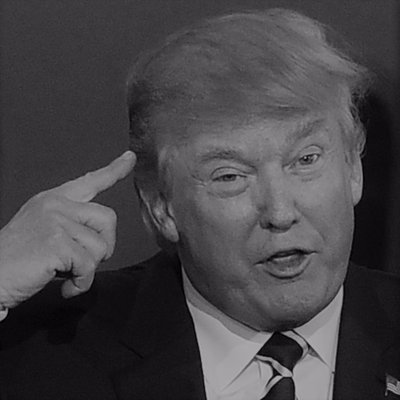
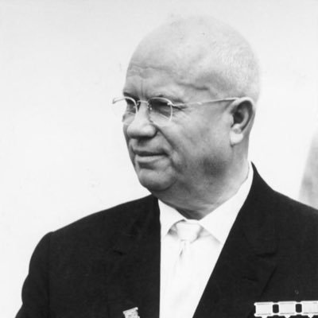
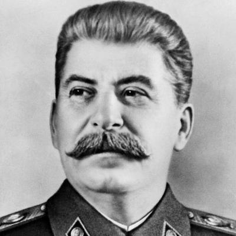

This is a game where the goal is to achieve the highest score possible by clicking on the correct images and avoiding the incorrect.

*note, this game is all for fun and is not meant to be political in any way. 

# 苏联方块攻略

| 图片 | 姓名 | 阵营 | 简介 |
|-----|------|------|------|
| |里根 | 资本主义   |   |
| |肯尼迪 | 资本主义   |   |
| |诶森豪威尔 | 资本主义   |   |
| |诶森豪威尔 | 资本主义   |   |
| |诶森豪威尔 | 资本主义   |   |
| |尼克松 | 资本主义   |   |
| |尼克松 | 资本主义   |   |
| |尼克松 | 资本主义   |   |
| |特朗普 | 资本主义   |   |
| |特朗普 | 资本主义   |   |
| |特朗普 | 资本主义   |   |
| |里根 | 资本主义   |   |
| |麦卡锡 | 资本主义   |   |
| |麦卡锡 | 资本主义   |   |
| |麦卡锡 | 资本主义   |   |
| |杜鲁门 | 资本主义   |   |
| |杜鲁门 | 资本主义   |   |
| |肯尼迪 | 资本主义   |   |
| |肯尼迪 | 资本主义   |   |
| |列宁 | 共产主义   |   |
| |赫鲁晓夫 | 共产主义   |   |
| |赫鲁晓夫 | 共产主义   |   |
| |勃列日涅夫 | 共产主义   |   |
| |勃列日涅夫 | 共产主义   |   |
| |安德罗波夫 | 共产主义   |   |
| |安德罗波夫 | 共产主义   |   |
| |契尔年科 | 共产主义   |   |
| |契尔年科 | 共产主义   |   |
| |戈尔巴乔夫 | 共产主义   |   |
| | 戈尔巴乔夫| 共产主义   |   |
| | 列宁| 共产主义   |   |
| | 列宁| 共产主义   |   |
| | 斯大林| 共产主义   |   |
| | 斯大林| 共产主义   |   |
| | 斯大林| 共产主义   |   |
| |马林科夫 | 共产主义   |   |
| |马林科夫 | 共产主义   |   |
| |赫鲁晓夫 | 共产主义   |   |
